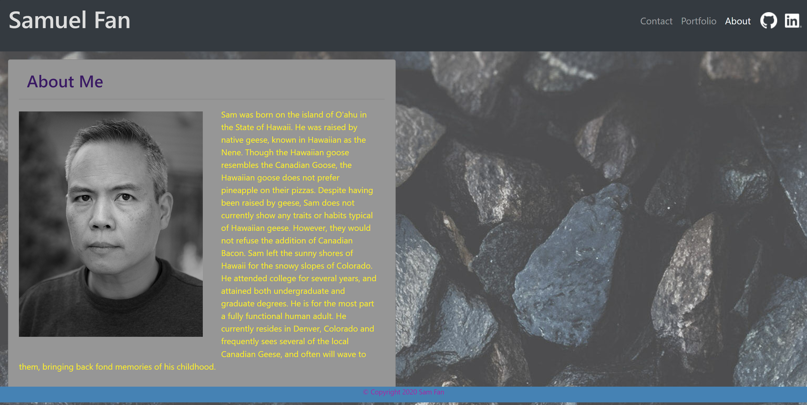
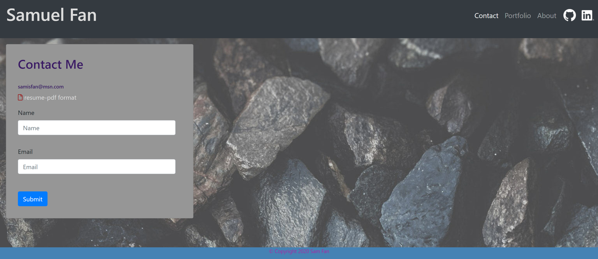

# Portfolio_hw_16
Revised portfolio homework for Unit 16

### Objective

Create a an updated portfolio with live links and repository links to selected projects.
Update contact information.

Utilizes: HTML, CSS, Bootstrap CSS, Font-Awesome

[Link to Portfolio](https://samfan808.github.io/Portfolio/index.html)

Screenshots below:

